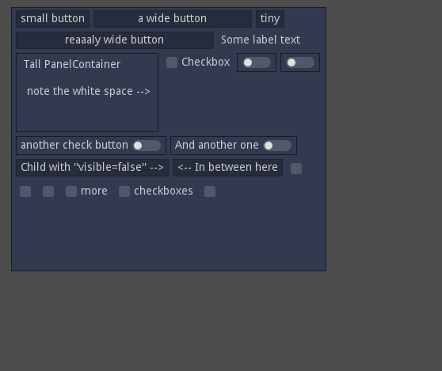

# Horizontal Flow Container
For use in the Godot game engine.

Places it's children in a horizontal row according to their minimal size, until it can't fit the next child on the row. Then it starts a new row.

The node is called "HFlowContainer" and is a child of "Container".

Features:
- Updates when it's width is changed.
- Works in the editor.
- Hiding children works.
- Customizable horizontal and vertical margins between the child nodes.
- Icon:

The container does (currently) not support:
- Child scaling.
- Child rotating.
- Child Size Flags ("Fill", "Expand" etc.)
